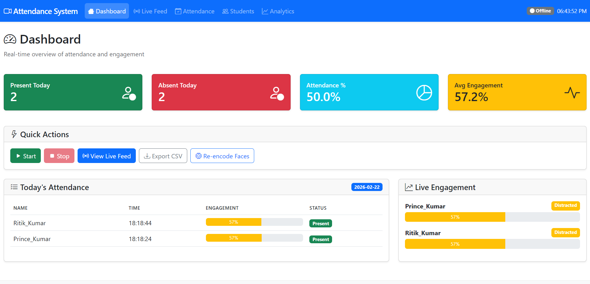

# 🎓 Real-Time Classroom Attendance and Student Engagement Tracking System

[](https://www.python.org/downloads/)
[](https://opencv.org/)
[](https://flask.palletsprojects.com/)
[](https://opensource.org/licenses/MIT)

An intelligent, production-ready system that uses Deep Learning and Computer Vision to automatically track student attendance and monitor engagement in real-time classroom environments.

## 📸 Dashboard Preview



## 🌟 Features

### 📸 Face Detection & Recognition
- **Multi-face Detection**: Detect up to 20+ faces simultaneously using MediaPipe
- **Deep Learning Recognition**: 128D face embeddings using ResNet architecture
- **Real-time Processing**: Optimized for CPU performance at 15-30 FPS
- **Duplicate Prevention**: Smart cooldown system prevents multiple attendance marks

### 📊 Engagement Tracking
- **Eye Aspect Ratio (EAR)**: Detect drowsiness and sleep
- **Head Pose Estimation**: Track attention direction (yaw, pitch, roll)
- **Blink Detection**: Monitor alertness through blink frequency
- **Engagement Scoring**: 0-100 score with categorization (Attentive/Distracted/Sleeping)

### 🖼️ Multi-Image Batch Attendance & Face Deduplication
- **Folder Input**: Process a folder of classroom photos in one shot
- **Cross-Image Deduplication**: Cosine-similarity embedding matching merges the same student across photos — 12 photos with 87 faces correctly resolves to unique students
- **Deduplication Report**: Images processed / faces detected / unique students / duplicates removed / unknown faces / avg similarity
- **CSV Report**: `exports/attendance_<date>.csv` with `Student, Present, Occurrences, Confidence`
- **No Retraining**: Uses the existing pretrained embedding pipeline
- **High-Resolution Safe**: Images processed one at a time, never loading the whole set into memory

### 🗳️ Temporal Recognition Voting
- **Majority-Vote Acceptance**: An identity is only accepted after it wins a majority of votes over a sliding 5-observation window, filtering out one-frame recognition errors (blur, occlusion, extreme pose)
- **Per-Track History**: Vote aggregation keyed by simple spatial face tracking

### ⚡ Adaptive Frame Skipping
- **FPS-Aware Stride**: 
  - FPS > 20 → process every 3rd frame
  - FPS 10–20 → process every 2nd frame
  - FPS < 10 → process every frame
- **Accuracy vs Latency Tradeoff**: Skips frames only when the pipeline has spare capacity

### ❓ Unknown Face Queue
- **Auto-Capture**: Unrecognized faces are cropped and saved to `unknown/` with a per-track cooldown to prevent duplicates
- **Teacher Review Dashboard**: Review unknown faces and register or ignore them from the dashboard
- **One-Click Registration**: Registering an unknown face adds its encoding to the live recognizer instantly


### 🔐 Security Features
- **Liveness Detection**: Blink-based verification prevents photo spoofing
- **Secure Database**: SQLite with parameterized queries
- **Configurable Thresholds**: Adjustable recognition confidence levels

### 📈 Dashboard & Analytics
- **Real-time Dashboard**: Live video feed with face annotations
- **Attendance Reports**: Daily/weekly/monthly attendance tracking
- **Engagement Analytics**: Per-student and class-wide engagement metrics
- **CSV Export**: Download attendance records for external use

```
                    IMAGE / VIDEO
                         │
                         ▼
                 Face Detection (MediaPipe)
                         │
               ┌─────────┴──────────┐
               │                    │
             VIDEO                IMAGES
               │                    │
     Temporal Voting         Face Embeddings
     Adaptive Skipping             │
               │              Deduplication
               │              (cosine similarity)
               │                    │
               └──────────┬─────────┘
                          ▼
                   Identity Matching
                          ▼
                      Attendance
                          │
            ┌─────────────┼─────────────┐
            ▼             ▼             ▼
        Engagement    Unknown Face    Analytics
        Detection      Queue           & Reports
```

## 🏗️ Project Structure

```
Real-Time-Face-Attendance-System/
│
├── app/
│   ├── __init__.py          # Flask application and routes
│   ├── detection/
│   │   └── __init__.py      # Face detection module (MediaPipe)
│   ├── recognition/
│   │   └── __init__.py      # Face recognition module (DeepFace) + temporal voting
│   ├── engagement/
│   │   └── __init__.py      # Engagement tracking module (FaceMesh)
│   ├── database/
│   │   └── __init__.py      # SQLite database operations
│   ├── utils/
│   │   └── __init__.py      # Helper functions, camera, logging
│   └── batch.py             # Multi-image attendance + deduplication pipeline
│
├── dataset/                  # Student face images
│   └── student_name/
│       ├── img1.jpg
│       └── img2.jpg
│
├── models/
│   └── encodings.pkl        # Generated face encodings
│
├── static/
│   ├── css/
│   │   └── style.css        # Custom styles
│   └── js/
│       └── main.js          # Frontend JavaScript
│
├── templates/               # HTML templates
│   ├── base.html
│   ├── index.html
│   ├── live.html
│   ├── attendance.html
│   ├── students.html
│   ├── analytics.html
│   └── register.html
│
├── main.py                  # Application entry point
├── batch_attendance.py      # Multi-image batch attendance CLI
├── collect_dataset.py       # Automatic dataset capture tool
├── config.py                # Configuration settings
├── requirements.txt         # Python dependencies
└── README.md
```

## 🚀 Quick Start

### Prerequisites

- Python 3.10 or higher
- Webcam or USB camera
- Windows/Linux/macOS

### Installation

1. **Clone the repository**
   ```bash
   git clone https://github.com/yourusername/Real-Time-Face-Attendance-System.git
   cd Real-Time-Face-Attendance-System
   ```

2. **Create virtual environment**
   ```bash
   python -m venv venv
   
   # Windows
   venv\Scripts\activate
   
   # Linux/macOS
   source venv/bin/activate
   ```

3. **Install dependencies**
   ```bash
   pip install -r requirements.txt
   ```

   > **Note**: First run will download face recognition models (~100MB). This is automatic and only happens once.

4. **Prepare the dataset**
   
   **Option A: Automatic Capture (Recommended)**
   ```bash
   python collect_dataset.py --name "John Doe"
   ```
   
   The capture tool guides you through poses:
   - 😐 Look straight at camera
   - 👈👉 Turn head left/right
   - 👆👇 Look up/down
   - 😊 Smile / neutral expression
   - 🔄 Small head movements
   
   **Controls:** `SPACE`=Capture, `A`=Auto-mode, `S`=Skip, `Q`=Quit
   
   **Option B: Manual Photos**
   
   Create folders for each student in the `dataset/` directory:
   ```
   dataset/
   ├── Prince_Kumar/
   │   ├── photo1.jpg
   │   ├── photo2.jpg
   │   └── photo3.jpg
   ├── Ritik_Kumar/
   │   ├── photo1.jpg
   │   └── photo2.jpg
   ```

   **📸 Dataset Tips:**
   - Capture 10-20 images per person
   - Include multiple angles (left, right, up, down)
   - Vary expressions (neutral, smile)
   - Capture in different lighting
   - Remove masks/glasses during capture
   - Face should fill 15-30% of frame

5. **Encode the faces**
   ```bash
   python main.py --encode
   ```

6. **Run the application**
   ```bash
   python main.py
   ```

7. **Open the dashboard**
   
   Navigate to `http://localhost:5000` in your browser.

## 📖 Usage Guide

### Command Line Options

```bash
# Start web server (default)
python main.py

# Start with custom port
python main.py --port 8080

# Enable debug mode
python main.py --debug

# Encode face dataset
python main.py --encode

# Run in CLI mode (no web interface)
python main.py --cli

# Use different camera
python main.py --camera 1

# Multi-image batch attendance from a photo folder
python batch_attendance.py classroom_photos/

# Show help
python main.py --help
```

### Web Interface

| Page | Description |
|------|-------------|
| **Dashboard** | Overview with stats, quick actions, and recent attendance |
| **Live Feed** | Real-time video with face detection and recognition |
| **Attendance** | View and filter attendance records by date |
| **Students** | Manage registered students |
| **Analytics** | Detailed engagement charts and statistics |
| **Register** | Add new students with face capture |

### API Endpoints

| Endpoint | Method | Description |
|----------|--------|-------------|
| `/api/start` | POST | Start the attendance system |
| `/api/stop` | POST | Stop the attendance system |
| `/api/stats` | GET | Get current statistics |
| `/api/attendance` | GET | Get attendance records |
| `/api/engagement` | GET | Get real-time engagement data |
| `/api/students` | GET/POST | List or add students |
| `/api/encode` | POST | Re-encode face dataset |
| `/api/export/csv` | GET | Export attendance to CSV |

## ⚙️ Configuration

All settings are in `config.py`. Key configurations:

### Detection Settings
```python
min_detection_confidence = 0.5  # Face detection threshold
max_faces = 20                   # Maximum faces per frame
```

### Recognition Settings
```python
recognition_threshold = 0.6      # Face match threshold (lower = stricter)
encoding_model = "large"         # 'small' or 'large'
attendance_cooldown_minutes = 30 # Prevent duplicate marking
```

### Engagement Settings
```python
ear_threshold = 0.21            # Eye closure threshold
yaw_threshold = 30.0            # Head rotation threshold
attentive_threshold = 70.0      # Score for "Attentive" status
distracted_threshold = 40.0     # Score for "Distracted" status
```

## 🔧 Troubleshooting

### Common Issues

**1. Camera not detected**
```bash
# Check available cameras
python -c "import cv2; print([cv2.VideoCapture(i).isOpened() for i in range(5)])"
```

**2. dlib installation fails**
- Install Visual Studio Build Tools (Windows)
- Or use pre-built wheels from the community

**3. Low FPS performance**
- Reduce `max_faces` in config
- Increase `frame_skip` value
- Use a lower camera resolution

**4. Recognition accuracy issues**
- Add more training images per student (5-10 recommended)
- Ensure good lighting in training images
- Use front-facing photos with clear face visibility

## 📊 Performance

| Metric | Value |
|--------|-------|
| Detection Speed | 20-30 FPS (CPU) |
| Recognition Speed | 10-15 FPS (CPU) |
| Max Faces | 20+ per frame |
| Database | SQLite (scales to 10K+ records) |

## 🚀 Deployment

### Local Deployment
```bash
# Production mode
python main.py --host 0.0.0.0 --port 80
```

### Docker Deployment
```dockerfile
FROM python:3.10-slim

WORKDIR /app
COPY requirements.txt .
RUN pip install --no-cache-dir -r requirements.txt

COPY . .
EXPOSE 5000

CMD ["python", "main.py", "--host", "0.0.0.0"]
```

### Cloud Deployment (AWS/GCP/Azure)

1. Set up a VM with Python 3.10+
2. Install dependencies
3. Configure security groups for port 5000
4. Use a process manager like `supervisor` or `systemd`
5. Set up HTTPS with nginx reverse proxy

## 🔮 Future Enhancements

- [ ] PostgreSQL support for larger deployments
- [ ] Mobile app integration
- [ ] Multi-camera support
- [ ] Cloud-based face encoding
- [ ] Email notifications for attendance
- [ ] Integration with LMS platforms
- [ ] GPU acceleration support

## 🤝 Contributing

1. Fork the repository
2. Create a feature branch (`git checkout -b feature/amazing-feature`)
3. Commit changes (`git commit -m 'Add amazing feature'`)
4. Push to branch (`git push origin feature/amazing-feature`)
5. Open a Pull Request

## 📄 License

This project is licensed under the MIT License - see the [LICENSE](LICENSE) file for details.

## 🙏 Acknowledgments

- [MediaPipe](https://mediapipe.dev/) - Face detection and mesh
- [DeepFace](https://github.com/serengil/deepface) - Face recognition & embeddings
- [Flask](https://flask.palletsprojects.com/) - Web framework
- [Bootstrap](https://getbootstrap.com/) - UI framework

## 📞 Support

For issues, questions, or contributions:
- Open an [Issue](https://github.com/theprincepratap/Real-Time-Classroom-Attendance-and-Student-Engagement-Tracking-System/issues)
- Email: theprincepratap@gmail.com

---

<p align="center">
  Made with ❤️ for the education sector By Prince Kuar 
</p>
