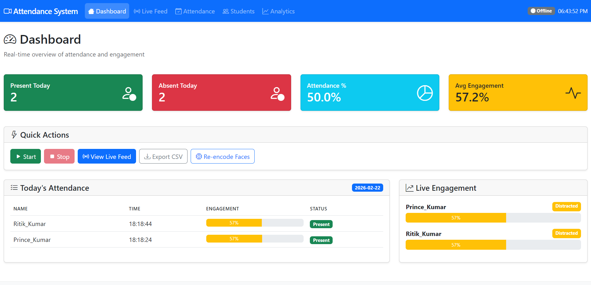
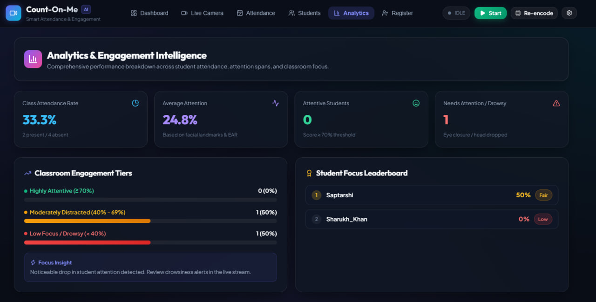

# 🎓 Count-On-Me | AI Classroom Attendance & Engagement Tracking System

[](https://www.python.org/downloads/)
[](https://react.dev/)
[](https://vitejs.dev/)
[](https://developers.google.com/mediapipe)
[](https://github.com/serengil/deepface)
[](https://flask.palletsprojects.com/)
[](https://opensource.org/licenses/MIT)

**Count-On-Me** is a high-performance, real-time computer vision platform designed for classroom attendance automation and multi-modal student engagement monitoring. 

Built with an **asynchronous decoupled AI pipeline**, it eliminates video freezing by streaming at **30–50+ FPS** while executing deep neural network facial recognition, 478 3D landmark analysis, temporal voting, unknown-face clustering, and live classroom session roster tracking.

---

## 📸 Platform Previews

| Live Camera Stream & Tuning | Classroom Analytics & Roster |
| :---: | :---: |
|  |  |

---

## ⚡ Key Architectural Innovations & Optimizations

### 1. Asynchronous Decoupled Vision Engine (30–50+ FPS)
Traditional synchronous CV loops execute detection, 478-point landmark meshing, deep neural network forward passes, and database I/O sequentially on the camera thread, causing frame rates to collapse to ~1.4 FPS (freezing video).

**Count-On-Me uses an Assembly Line architecture:**
* **Fast Path (Camera Thread, < 20ms)**:
  * Google MediaPipe Tasks **BlazeFace** (`blaze_face_short_range.tflite`): ~5.7ms (29x faster than CPU Haar cascades).
  * MediaPipe Tasks **FaceLandmarker** (`face_landmarker.task`): ~13ms for 478 3D landmarks + blendshapes.
  * Spatial Centroid Tracking: < 1ms to assign persistent `track_id`s.
  * Instant overlay rendering and MJPEG frame transmission.
* **Slow Path (Background Daemon Worker)**:
  * Heavy DeepFace embedding inference is decoupled into a dedicated worker thread via a thread-safe FIFO queue (`_recog_queue`).
  * Vectorized batch forward passes (up to 8 faces per batch).
  * **3.0s Cache TTL** with an atomic `in_flight` gate: Recognized identities are cached for 3 seconds per physical track, completely removing redundant forward passes.

```
CAMERA CAPTURE (30-50+ FPS)
      │
      ├─► MediaPipe BlazeFace (~5.7ms)
      │
      ├─► MediaPipe FaceLandmarker (~13ms, 478 3D Points)
      │
      ├─► Spatial Centroid Track Association (track_id)
      │
      ├─► Check Cache TTL (>3.0s & not in_flight?)
      │         │
      │         ├─► [Yes] ──► Push Crop to _recog_queue (0ms wait) ──► Worker Thread
      │         │                                                        │ (Batched ArcFace)
      │         └─► [No]  ──► Re-use Cached Identity                    ▼
      │                                                        Update Track Identity
      └─► Immediate Overlay Render ──► Browser Stream
```

### 2. Robust Track-Keyed Engagement Tracking
Unlike basic enumeration index systems where face ordering swaps cross-contaminate student histories, Count-On-Me binds engagement states strictly to persistent spatial `track_id`s:
* **Position Swaps & Crowds**: If Alice and Bob swap positions or the detector yields them in reverse order, their blink state machines, EAR histories, and head pose smoothers remain strictly isolated.
* **Classroom Exit (Restroom / Leaving)**: When a student leaves the frame, their track cleanly expires after 3 seconds, and `prune_stale_tracks()` purges their temporal buffer. Other students never inherit abandoned history.
* **Return to Frame**: When a student returns, they receive a fresh track ID with a clean blink queue, get re-identified by the recognition worker, and their aggregate session attendance records resume seamlessly.

### 3. Latency & Performance Comparison

| Pipeline Component | Legacy Implementation | Count-On-Me Implementation | Performance Gain |
| :--- | :--- | :--- | :--- |
| **Face Detection** | OpenCV Haar Cascade (CPU window scan) | **MediaPipe BlazeFace TFLite SIMD** | **29x faster** (166ms ➔ 5.7ms) |
| **Facial Landmarks & EAR** | Haar Box Fallback (static estimation) | **MediaPipe FaceLandmarker (478 3D points)** | **12x faster** (166ms ➔ 13ms) |
| **Face Recognition** | Synchronous ArcFace on camera loop | **Async Queue + 3.0s Cache TTL + Batched Tensors** | **0ms on camera loop** |
| **Database Operations** | Synchronous SQLite queries 60+ times/sec | **2.0s Session Cache + 3.0s Score Throttling** | **Zero disk lock contention** |
| **End-to-End Stream** | 650–750 ms / frame (**1.4 FPS slideshow**) | **< 20 ms / frame (**30–50+ FPS smooth**)** | **Silky-smooth real-time** |

---

## 🌟 Core Features

### 🎥 Real-Time Monitoring & Liveness Verification
* **High-FPS Video Stream**: Overlaid with bounding boxes, names, recognition confidence, and real-time engagement status.
* **Liveness Detection**: Blink-based anti-spoofing verification ensures physical presence and defends against printed or smartphone photos.
* **Configurable False-Positive Noise Filter**: Sliders for `min_face_size` (default 55px), detection confidence, and recognition thresholds.

### 🧠 Multi-Modal Student Engagement Tracking
* **Eye Aspect Ratio (EAR)**: Real-time eye opening/closing dynamics to detect drowsiness or closed eyes.
* **3D Head Pose Estimation**: Continuous calculation of Yaw (left/right), Pitch (up/down), and Roll (tilt) to verify focus toward the board/instructor.
* **Dynamic Blink Frequency**: Rolling 60-second blink rate analysis derived from 3D eye landmarks and blendshapes.
* **Composite Scoring**: Weighted algorithm (EAR + Head Pose + Blink Rate) categorizing students into **Attentive**, **Distracted**, or **Sleeping**.

### 🏫 Classroom Sessions & Real-Time Roster Tracking
* **Scheduled Lectures**: Create, select, or manage classroom sessions (e.g., *Physics - Lecture 1: General Mechanics*).
* **Live Roster Verification**: Active tracking of Present, Absent, and Late students mapped to enrolled course rosters.
* **Attendance Cooldown**: Configurable duplicate prevention (default 30 minutes) ensuring each student is only recorded once per session.

### ❓ Unknown Face Review Queue & Deduplication Clustering
* **Automatic Capture**: Unrecognized faces are automatically cropped and queued with cooldowns to avoid duplicate captures.
* **DBSCAN / Cosine Clustering ("Clusterify")**: Groups multiple captures of the same unknown student together into clean face clusters.
* **One-Click Registration**: Click any unknown face card to immediately populate the student registration modal with cropped images and auto-encode them into the live recognizer.

### 📁 Multi-Image Batch Attendance (Photo Folder Processing)
* **High-Resolution Classroom Photo Ingestion**: Process folders of wide-angle classroom photos in one batch.
* **Cross-Image Deduplication**: Vectorized cosine similarity matching merges identical students across multiple images.
* **Detailed Reports**: Generates instant CSV attendance sheets (`exports/attendance_<date>.csv`) with occurrence counts, confidence, and timestamp logs.

---

## 🏗️ Project Architecture

```
Count-On-Me/
├── app/
│   ├── __init__.py           # Flask server, async camera loop & API routes
│   ├── detection/            # MediaPipe Tasks BlazeFace detector
│   ├── recognition/          # DeepFace ArcFace recognizer & temporal voter
│   ├── engagement/           # 478 3D FaceLandmarker & track-keyed analyzer
│   ├── database/             # SQLite ORM (Students, Attendance, Sessions)
│   ├── utils/                # CameraStream, FPSCounter, image utilities
│   └── batch.py              # Multi-photo cross-image deduplication pipeline
│
├── frontend/                 # Modern React (Vite + TailwindCSS + Lucide)
│   ├── src/
│   │   ├── components/       # Dashboard, LiveFeed, Attendance, Sessions, etc.
│   │   ├── api.js            # Axios/Fetch API client & SSE event listeners
│   │   └── App.jsx           # Main routing & dark glassmorphic layout
│   ├── package.json          # Frontend dependencies
│   └── vite.config.js        # Vite dev server configuration (Port 3000)
│
├── android-app/              # Native Android application client
├── dataset/                  # Enrolled student face image directories
├── models/                   # TFLite & Task models (BlazeFace, Landmarker, encodings)
├── exports/                  # Generated CSV attendance and audit reports
├── unknown/                  # Cropped unknown face queue storage
├── main.py                   # Backend entry point (Web & CLI modes)
├── config.py                 # Central system configuration
└── requirements.txt          # Python dependencies
```

---

## 🚀 Quick Start Guide

### Prerequisites
* **Python 3.10+** (Tested on Python 3.10 – 3.13)
* **Node.js 18+** & npm
* Webcam or USB Video Camera

---

### Step 1: Clone the Repository
```bash
git clone https://github.com/Saptarshie/Count-On-Me.git
cd Count-On-Me
```

---

### Step 2: Backend Setup (Python)
1. **Create and activate a virtual environment**:
   ```bash
   # Windows
   python -m venv venv
   venv\Scripts\activate

   # Linux / macOS
   python3 -m venv venv
   source venv/bin/activate
   ```

2. **Install Python dependencies**:
   ```bash
   pip install -r requirements.txt
   ```

3. **Verify pretrained models**:
   The system uses MediaPipe Tasks models located in `models/`:
   * `models/blaze_face_short_range.tflite`
   * `models/face_landmarker.task`

---

### Step 3: Frontend Setup (React + Vite)
```bash
cd frontend
npm install
```

---

### Step 4: Prepare Student Dataset & Encodings
You can enroll students in two ways:
* **Option A: Web Studio (Recommended)**: Launch the app and visit the **Register** tab to capture student poses directly from the browser.
* **Option B: Manual Folder Structure**: Create a directory per student under `dataset/`:
  ```
  dataset/
  ├── John_Doe/
  │   ├── photo1.jpg
  │   └── photo2.jpg
  └── Jane_Smith/
      ├── photo1.jpg
      └── photo2.jpg
  ```
  Generate embeddings via CLI:
  ```bash
  python main.py --encode
  ```

---

### Step 5: Run the Platform

Open two terminals:

**Terminal 1 (Backend API & Vision Engine)**:
```bash
# In repository root
python main.py
```
*Backend runs on `http://localhost:5000`.*

**Terminal 2 (Modern React Web UI)**:
```bash
cd frontend
npm run dev
```
*Frontend runs on `http://localhost:3000`.*

---

## 📖 CLI Usage

```bash
# Start Flask web server (default)
python main.py

# Start with custom host and port
python main.py --host 0.0.0.0 --port 5000

# Encode faces in the dataset folder
python main.py --encode

# Run in pure CLI camera mode (no web UI)
python main.py --cli

# Specify a different camera index (e.g., USB webcam)
python main.py --camera 1

# Multi-image batch attendance from a classroom photo folder
python batch_attendance.py path/to/classroom_photos/
```

---

## 🔌 API Reference

### System & Stream
| Method | Endpoint | Description |
| :--- | :--- | :--- |
| `GET` | `/video_feed` | Multipart MJPEG real-time video stream |
| `GET` | `/api/stream/events` | Server-Sent Events (SSE) for live activity & stats |
| `POST` | `/api/start` | Starts the camera processing loop |
| `POST` | `/api/stop` | Stops the camera processing loop |
| `GET` | `/api/stats` | Fetches active session statistics and FPS |
| `POST` | `/api/encode` | Re-encodes the face dataset in the background |

### Sessions & Attendance
| Method | Endpoint | Description |
| :--- | :--- | :--- |
| `GET` | `/api/sessions` | Lists all classroom sessions |
| `POST` | `/api/sessions` | Creates a new classroom session |
| `GET` | `/api/sessions/active` | Gets the currently selected active session |
| `POST` | `/api/sessions/active` | Sets the current active session |
| `GET` | `/api/attendance` | Fetches attendance logs (filterable by date & session) |
| `PATCH`| `/api/attendance/<id>` | Updates a record's attendance status or score |
| `POST` | `/api/attendance/manual`| Manually marks a student present/absent |
| `GET` | `/api/export/csv` | Exports session attendance records as CSV |

### Students & Registration
| Method | Endpoint | Description |
| :--- | :--- | :--- |
| `GET` | `/api/students` | Lists all enrolled students |
| `POST` | `/api/register-student` | Enrolls a student with face captures and updates encodings |
| `DELETE`| `/api/students/<id>` | Deletes an enrolled student and their encodings |

### Unknown Faces Review Queue
| Method | Endpoint | Description |
| :--- | :--- | :--- |
| `GET` | `/api/unknown-faces` | Retrieves captured unknown faces (`?cluster=true` for clusters) |
| `POST` | `/api/unknown-faces/clusterify`| Performs DBSCAN clustering to group same unknown faces |
| `POST` | `/api/unknown-faces/register` | Registers an unknown face directly to a student |
| `POST` | `/api/unknown-faces/clear` | Clears all pending unknown faces |

---

## ⚙️ Configuration (`config.py`)

All thresholds and parameters can be configured in [`config.py`](config.py):

```python
# Detection & Filter
config.detection.min_detection_confidence = 0.5   # BlazeFace confidence
config.detection.min_face_size = 55               # False-positive noise filter (px)
config.detection.max_faces = 20                   # Max simultaneous faces

# Recognition & Caching
config.recognition.batch_size = 8                 # Vectorized inference batch size
config.recognition.cache_ttl_seconds = 3.0        # Identity cache duration for a track
config.recognition.attendance_cooldown_minutes = 30 # Prevents duplicate marking

# Engagement Tracking
config.engagement.ear_threshold = 0.21            # Eye closure threshold (EAR)
config.engagement.ear_consecutive_frames = 20     # Frames before sleep trigger
config.engagement.yaw_threshold = 30.0            # Left/Right head turn angle
config.engagement.pitch_threshold = 25.0          # Up/Down head tilt angle
config.engagement.attentive_threshold = 70.0      # Score threshold for Attentive
config.engagement.distracted_threshold = 40.0     # Score threshold for Distracted

# Temporal Voting
config.temporal.enabled = True                    # Filter single-frame recognition errors
config.temporal.window_frames = 5                 # Rolling observation window
config.temporal.min_votes = 3                     # Majority votes needed
```

---

## 🛠️ Troubleshooting

1. **Camera Not Opening**:
   * Verify camera access permissions in your OS.
   * Test available cameras: `python -c "import cv2; print([cv2.VideoCapture(i).isOpened() for i in range(5)])"`.
   * Pass `--camera <index>` if your webcam is not index 0.
2. **DeepFace First Run**:
   * On initial startup, DeepFace downloads ArcFace model weights (~100MB). Ensure an active internet connection on the first run.
3. **Low FPS on Older Hardware**:
   * Adjust `min_face_size` in the web UI slider to filter distant background clutter.
   * Enable adaptive frame skipping in `config.py` (`adaptive_skip_enabled = True`).

---

## 📄 License
This project is licensed under the MIT License - see the [LICENSE](LICENSE) file for details.

## 🙏 Acknowledgments
* [Google MediaPipe](https://developers.google.com/mediapipe) for BlazeFace and 3D FaceLandmarker.
* [DeepFace](https://github.com/serengil/deepface) for ArcFace deep embeddings.
* [Vite](https://vitejs.dev/) & [TailwindCSS](https://tailwindcss.com/) for the frontend build ecosystem.
