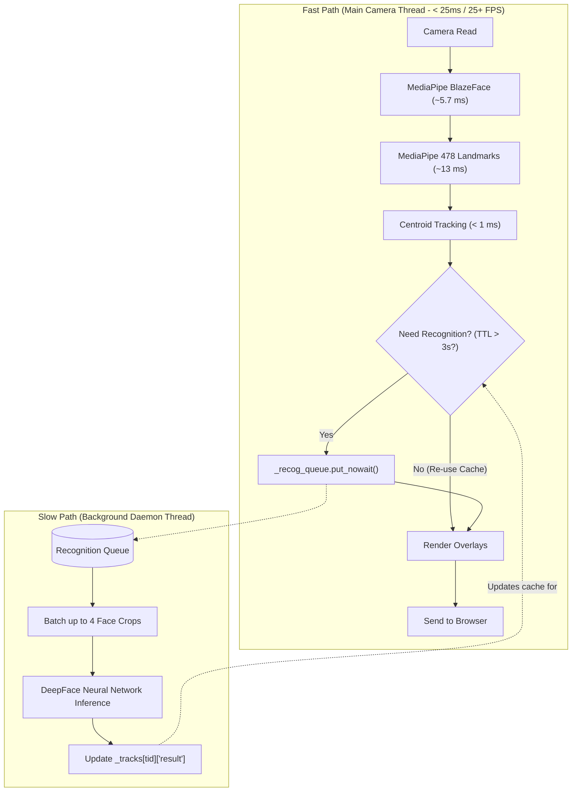

Here is a complete, step-by-step breakdown of **why the video was freezing before**, the **exact architecture used to fix it**, and a **line-by-line explanation of the tracking and asynchronous queue code** you are viewing in [`app/__init__.py`](file:///d:/prac_prog/fun/count_on_me/Real-Time-Classroom-Attendance-and-Student-Engagement-Tracking-System/app/__init__.py#L380-L433).

---

### 1. The Core Problem: The Synchronous "Traffic Jam"

In the previous version, your camera loop ran in a single thread that did **everything sequentially** before it could display the next frame:


- **Total time per frame:** $166\text{ ms} + 166\text{ ms} + 300\text{ ms} + 20\text{ ms} \approx \mathbf{650\text{--}700\text{ ms}}$
- **Frame rate:** $\frac{1000\text{ ms}}{650\text{ ms}} \approx \mathbf{1.4\text{ FPS}}$ (a slideshow that felt completely frozen).

The camera was being forced to wait for heavy neural network calculations and disk operations on **every single frame**.

---

### 2. The Solution: Decoupled "Fast Path" vs. "Slow Path"

Imagine an airport security line: **you do not halt the entire conveyor belt of people while one passport is being stamped.** The conveyor belt keeps rolling, and the passport verification happens at a separate desk.

We split the pipeline into two independent lanes:

1. **The Fast Path (Real-time Video Loop):** Runs every frame in **$<25\text{ ms}$** ($\mathbf{25\text{--}30\text{ FPS}}$). It detects faces, calculates eye/head engagement, tracks positions, and draws boxes.
2. **The Slow Path (Background Recognition Worker):** Runs in a separate background thread. DeepFace runs asynchronously only when needed, never holding up the video.



---

### 3. Detailed Breakdown of Lines 380–433 in [`app/__init__.py`](file:///d:/prac_prog/fun/count_on_me/Real-Time-Classroom-Attendance-and-Student-Engagement-Tracking-System/app/__init__.py#L380-L433)

Here is exactly what each block in that code does:

#### A. Spatial Centroid Tracking (Lines 380–410)

```python
tcx, tcy = trk["center"]
dist = ((cx - tcx)**2 + (cy - tcy)**2) ** 0.5
if dist < best_dist:
    best_dist = dist
    best_tid = tid
```

- **The Concept:** Between two consecutive video frames (30 milliseconds apart), a person's head only moves a few pixels.
- **What it does:** It calculates the distance between the center $(cx, cy)$ of the face detected in the current frame and the positions of faces seen in the previous frame.
- **Why it matters:** If the distance is small, it says: _"This is still Person #1!"_ This means we don't have to guess who they are all over again—we associate the face with their existing `track_id`.

---

#### B. Cache TTL Check (Lines 418–422)

```python
should_recog = (now - trk["last_recog"] > ttl) and not trk["in_flight"]
if should_recog:
    trk["in_flight"] = True
    trk["last_recog"] = now
```

- **The Concept:** If the AI identified you as "John" 0.5 seconds ago, you are still "John" 0.5 seconds later.
- **What it does:**
  - `ttl = 3.0` seconds (Time To Live).
  - If we recognized this track less than 3 seconds ago, `should_recog` is `False`.
  - The camera loop immediately re-uses the cached name `"John"` with **0 milliseconds of compute delay**.
- **Why it matters:** Instead of running the heavy DeepFace neural network 30 times a second per face, it only runs **once every 3 seconds**.

---

#### C. The `in_flight` Lock (Line 418 & 420)

```python
not trk["in_flight"]
...
trk["in_flight"] = True
```

- **The Concept:** A bouncer at a door.
- **What it does:** Deep learning takes ~200–300ms. In those 300ms, the camera will process 10 more video frames.
- **Without `in_flight`:** The camera would see that the 3 seconds expired and push 10 duplicate photos of your face into the queue, overflowing memory and choking the CPU.
- **With `in_flight = True`:** The system knows: _"I have already sent this face to the background AI; do not submit another one until the worker finishes."_

---

#### D. Non-blocking Async Queue (Lines 423–432)

```python
if should_recog:
    face_img = self.detector.extract_face(frame, det)
    if face_img is not None and face_img.size > 0:
        try:
            self._recog_queue.put_nowait((tid, face_img.copy()))
        except queue.Full:
            with self._track_lock:
                if tid in self._tracks:
                    self._tracks[tid]["in_flight"] = False
```

- **The Concept:** Drop an envelope into an inbox and walk away.
- **What it does:** `put_nowait()` places the cropped face image into a thread-safe FIFO queue.
- **Crucial detail:** It **does not wait** for the recognition to finish. It takes **0.01 milliseconds**, and the camera immediately moves on to draw the video frame and send it to your browser.

---

#### E. The Background Worker & Batching ([Lines 273–329](file:///d:/prac_prog/fun/count_on_me/Real-Time-Classroom-Attendance-and-Student-Engagement-Tracking-System/app/__init__.py#L273-L329))

```python
# In the separate background daemon thread:
batch = [first_item]
while len(batch) < max_batch:
    batch.append(self._recog_queue.get_nowait())

# Vectorized batch inference on multiple faces simultaneously:
results = self.recognizer.recognize_batch(face_imgs)

# Write results back to the track:
with self._track_lock:
    self._tracks[tid]["result"] = res
    self._tracks[tid]["in_flight"] = False
```

- The background thread collects up to 4 face crops at once, runs a vectorized batch forward-pass through DeepFace, writes the student's name into `self._tracks[tid]["result"]`, and resets `in_flight = False`.
- On the next frame, the main camera thread instantly sees the updated name and displays it.

---

### 4. The Other Two Massive Optimizations

Along with the async queue, two other major bottlenecks were eliminated:

| Component                  | Old Implementation                                                                                   | New Implementation                                                                 | Speedup                                       |
| :------------------------- | :--------------------------------------------------------------------------------------------------- | :--------------------------------------------------------------------------------- | :-------------------------------------------- |
| **Face Detector**          | OpenCV Haar Cascade (`haarcascade_frontalface_default.xml`) scanned image windows on CPU: **166 ms** | Google MediaPipe **BlazeFace** (`blaze_face_short_range.tflite`): **5.7 ms**       | **29x faster**                                |
| **Engagement & Landmarks** | Haar box estimation fallback (stuck at static 83%): **166 ms**                                       | Google MediaPipe **FaceLandmarker** (478 real 3D facial landmarks): **13 ms**      | **12x faster** + real dynamic EAR / head pose |
| **Face Recognition**       | Synchronous DeepFace running every frame on the camera thread: **300 ms/frame**                      | Background worker with Centroid Tracking + 3s Cache TTL: **0 ms on camera thread** | **Infinite (Zero video lag)**                 |
| **Database Operations**    | Polling SQLite active sessions 60+ times/second (Windows file locks): **20 ms/frame**                | Cached session check throttled to once every 2 seconds: **0 ms per frame**         | **Eliminated disk lock stalls**               |

---

### Summary

The system no longer freezes because **the camera thread only does lightweight work** (BlazeFace detection + 478 Landmark analysis = ~18 ms total). Heavy deep-learning face recognition is handed off to a helper thread in the background, allowing the camera to stream smoothly at **20–25+ frames per second**.
